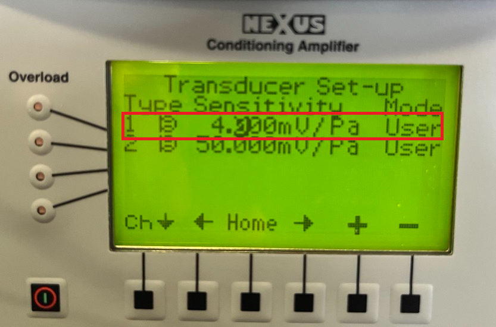

# Speaker calibration

- Instructions for calibrating rig speaker
- **Purpose**: Speaker has nonlinear response across frequencies, must ensure voltage delivered to speaker corresponds to desired dB output for various signals
- **Output**: gain values corresponding to voltage needed to drive speaker to obtain desired dB SPL

## Tools
- Oscilloscope: [Tektronix TDS2002B](https://www.tek.com/en/oscilloscope/tds1001b-manual/tds1000b-and-tds2000b-series)
- microphone with attached pre-amp (1/8 inch 4138-A-015; Brüel and Kjær / HBK)
- reference sound calibrator (Type 4231, Brüel and Kjær / HBK)
- amp (Nexus 2690-0S Brüel and Kjær / HBK)
- Brüel and Kjær / HBK tool contact: Isaac.farzaneh@hbkworld.com | 800-332-2040

## Prerequisite: calibration stimuli
- Generate stimuli in MATLAB. See: [stimuli generation code](https://github.com/xiubert/matlabPAC_general/tree/master/stimuliGeneration)

## 1. Amp setup
1. Setup Menu: 
2. Amplifier Set-up: Output sensitivity from Nexus amp
    - Can set the output to 3.16 V/Pa as shown below. Make sure the band-pass filter is configured correctly so the system can read the 1000 Hz tone from the 4231 calibrator. Setting the filter to 0.1–100 kHz allows the full usable frequency range to pass through.
    - 1 Pa corresponds to 94 dB
    - 
2. Transducer Set-up:  Microphone sensitivity
    - The nominal sensitivity of the 4939-A-011 is 4 mV/Pa, but if you have a calibration card for your specific microphone (inside microphone box), you should enter the actual calibrated sensitivity shown on the card.
    - 
2. Transducer Supply:  Microphone sensitivity
    - Set the polarization voltage to 200 V. The 4939-A-011 is an externally polarized microphone, so it requires a 200 V polarization supply.
    - 

## 3. Record 94 dB reference voltage
- 1 Pa corresponds to 94 dB. Type 4231 reference speaker outputs 1 kHz at 94 dB. Thus, if output sensitivity set to 3.16 V / Pa, should see 3.16 V RMS on oscilloscope with 'Autoset'

## 4. Record stimuli voltage
- Set gain to 1500 and record voltage for stimuli that are to be calibrated

## Reference
- see: [sound level equations](https://github.com/xiubert/matlabPAC_general/tree/master/helperFcns/auditory)

### Volt2dB
```
dB = 20 · log₁₀(V_out/V_ref) + dB_ref
```

### dBwant2voltage
```
dB = 20 · log₁₀(V_want/V_ref) + dB_ref

[  ] = (dB - dB_ref)/20

10^[(dB - dB_ref)/20]

V_want/V_ref = 10^((dB - dB_ref)/20)

V_want = 10^((dB - dB_ref)/20) · V_ref
```

### Vwant2gain
```
V_Gref/G_ref = V_want/G_set

G_set = G_ref · (V_want/V_Gref)
```
