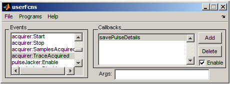
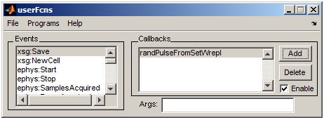
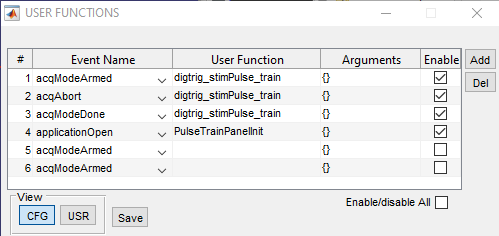

# Configuration

## Ephus

### Startup file
- [ephus_init_matlab2013b_32bit_250kHz_Camera_20250903.m](config/Ephus/ephus_init_matlab2013b_32bit_250kHz_Camera_20250903.m)

**Key configuration values**:
```matlab
xsgStartDirectory = 'D:\Data\sutter2P\';

%Acquirer channels (Analog Input)
acqChannelNames = {'sound output check', 'Green LED output check'};                   % Cell array of descriptive names for analog input acquisition channels to configure, e.g. {'Lick Sensor' 'Nose Poke Sensor'}, 
acqBoardIDs = [2 2];                       % A single number (e.g. 1 for 'Dev1') specifying DAQmx board for /all/ named acquisition channels; or, an array of numbers of length equal to 'acqChannelNames' (e.g. [1 1 1 2 2] indicating 'Dev1' for first 3 channels, 'Dev2' for last 2 channels) identifying DAQmx board on which each of the named acquisition channels appears. 
acqChannelIDs =  [16 17];                    % Array of numbers, of length equal to 'acqChannelNames', identifying DAQmx channel number (e.g. 1 for AI1) for each of the named acquisition channels (e.g. [0 1 2 0 1] indicating AI0-2 for first 3 channels  and AI0-1 for last 2 channels, for case of multiple boards). 

%Stimulator channels (Analog Output) 
stimChannelNames = {'Sound output', 'Blue LED output', 'Camera trigger', 'Green LED output'};                  % Cell array of descriptive names for analog output stimulus channels to configure, e.g. {'Whisker Stimulator' 'Position Encoder'}, 
stimBoardIDs = [2 2 2 2];                      % A single number (e.g. 1 for 'Dev1') specifying DAQmx board for /all/ named analog stimulus channels; or, an array of numbers of length equal to 'stimChannelNames' (e.g. [1 1 1 2 2] indicating 'Dev1' for first 3 channels, 'Dev2' for last 2 channels) identifying DAQmx board on which each of the named analog stimulus channels appears. 
stimChannelIDs = [1 2 3 0];                    % Array of numbers, of length equal to 'stimChannelNames', identifying DAQmx channel number (e.g. 1 for AI1) for each of the named analog stimulus channels (e.g. [0 1 2 0 1] indicating AI0-2 for first 3 channels  and AI0-1 for last 2 channels, for case of multiple boards). 


initialSampleRate = 250000;              %(REQUIRED) Initial rate, in Hz, to use for all analog and digital input/output channels configured for use in Ephus


triggerOrigin = '/dev2/port0/line2';                     %(REQUIRED) Full DAQmx specification of single digital line on /one/ board (e.g. '/dev1/port0/line0') used as the Ephus default trigger pulse to synchronize the one or more boards.
triggerDestinations = {'PFI9','PFI0'}; %PFIO is external trigger-CTA            %(REQUIRED) Cell array of one or more DAQmx PFI terminal names configured as the choice of PFI terminals on which Ephus must receive a trigger input signal, on /all/ of the DAQmx boards configured for use by Ephus.

sampleClockOrigin = '/dev2/ctr0'; %this is ctr0 is PFI12, ctr1 is PFI13 CTA                % Full DAQmx specification of single counter output channel on /one/ board (e.g. '/dev1/ctr0') on which the sample clock generated by Ephus appears. Ephus employs the default DAQmx routing of counter output channels to PFI output terminals (PFI12 for CTR0, PFI13 for CTR1; refer to DAQmx documentation for further information), Full DAQmx specification of counter output channel on /one/ board (e.g. '/dev1/ctr0') on which the sample clock is generated.
sampleClockDestination = 'PFI10';            % A DAQmx PFI terminal name (e.g. 'PFI1') on which sample clock is input on /all/ of the boards used by Ephus
```

- Internal `triggerOrigin` `P0.2` goes to `PFI9` – `PFI9` is for triggering internal to Ephus​
- `PFI0` of Dev2/USB-6229 (BNC port) is connected to Dev1/PCI-6110 USER2 BNC port.​
- Dev1/USER2 is connected to Dev1/PFI13​

### Initial configuration state
- `*.settings` for each Ephus window at startup: [config/Ephus/init_config](config/Ephus/init_config)
- Chosen at Ephus start
- Located in `C:/Rig/Ephus 2013b/startup/config/init_config`

### Custom user functions
- Located in `C:/Rig/Ephus 2013b/custom_user_fcns`




- [savePulseDetails.m](config/Ephus/savePulseDetails.m): Save stimulus pulse details to .mat file. This will save the pulse details and traceAcquired time in a mat file using the same path and naming convention as the xsg settings.



- [randPulseFromSetWOrepl.m](config/Ephus/randPulseFromSetWOrepl.m): update selected pulse to random in list (without replacement)
- [randPulseFromSetWrepl.m](config/Ephus/randPulseFromSetWrepl.m): update selected pulse to random in list (with replacement)


- [qcamExternalReset.m](config/Ephus/qcamExternalReset.m): Resets QCam to External automatically to enable loops. Otherwise would need to manually click External off and on.
    - See: [Ephus looping](operation.md#ephus-looping)
- [testusrfcn.m](config/Ephus/testusrfcn.m): for testing user functions

## ScanImage

### Machine Data File (startup)
- [Machine_Data_File.m](config/ScanImage/Machine_Data_File.m)

**Key configuration values**:
```matlab
shutterDaqDevices = {'Dev1'};  % Cell array specifying the DAQ device or RIO devices for each shutter eg {'PXI1Slot3' 'PXI1Slot4'}
shutterChannelIDs = {'port0/line7'};      % Cell array specifying the corresponding channel on the device for each shutter eg {'PFI12'}

motors(1).controllerType = 'sutter.mpc200';           % If supplied, one of {'sutter.mp285', 'sutter.mpc200', 'thorlabs.mcm3000', 'thorlabs.mcm5000', 'scientifica', 'pi.e665', 'pi.e816', 'npoint.lc40x'}.
motors(1).dimensions = 'XYZ';               % Assignment of stage dimensions to SI dimensions. Can be any combination of X,Y,Z, and R.
motors(1).comPort = 3;                  % Integer identifying COM port for controller, if using serial communication
motors(1).customArgs = {};               % Additional arguments to stage controller. Some controller require a valid stageType be specified
motors(1).invertDim = '+++';                % string with one character for each dimension specifying if the dimension should be inverted. '+' for normal, '-' for inverted

motors(1).moveCompleteDelay = 5;        % Delay from when stage controller reports move is complete until move is actually considered complete. Allows settling time for motor

%% LinScan (LinScanner)
deviceNameAcq = 'Dev1';      % string identifying NI DAQ board for PMT channels input
deviceNameGalvo = 'Dev1';      % string identifying NI DAQ board for controlling X/Y galvo. leave empty if same as deviceNameAcq

shutterIDs = 1;                     % Array of the shutter IDs that must be opened for linear scan system to operate

%Acquisition
channelIDs = [0 1 2 3];                    % Array of numeric channel IDs for PMT inputs. Leave empty for default channels (AI0...AIN-1)

%Scanner control
XMirrorChannelID = 0;               % The numeric ID of the Analog Output channel to be used to control the X Galvo.
YMirrorChannelID = 1;               % The numeric ID of the Analog Output channel to be used to control the y Galvo.

xGalvoAngularRange = 30;            % max range in optical degrees (pk-pk) for x galvo
yGalvoAngularRange = 30;            % max range in optical degrees (pk-pk) for y galvo

voltsPerOpticalDegreeX = 0.333;         % galvo conversion factor from optical degrees to volts (negative values invert scan direction)
voltsPerOpticalDegreeY = 0.333;         % galvo conversion factor from optical degrees to volts (negative values invert scan direction)

scanParkAngleX = 7.5;              % Numeric [deg]: Optical degrees from center position for X galvo to park at when scanning is inactive
scanParkAngleY = 7.5;              % Numeric [deg]: Optical degrees from center position for Y galvo to park at when scanning is inactive

%Optional: mirror position offset outputs for motion correction
deviceNameOffset = '';              % string identifying NI DAQ board that hosts the offset analog outputs
XMirrorOffsetChannelID = 0;         % numeric ID of the Analog Output channel to be used to control the X Galvo offset.
YMirrorOffsetChannelID = 1;         % numeric ID of the Analog Output channel to be used to control the y Galvo offset.

XMirrorOffsetMaxVoltage = 1;        % maximum allowed voltage output for the channel specified in XMirrorOffsetChannelID
YMirrorOffsetMaxVoltage = 1;        % maximum allowed voltage output for the channel specified in YMirrorOffsetChannelID

internalRefClockSrc = '';
```

### User Settings File:
- [working_acqModeArmed.cfg](config/ScanImage/working_acqModeArmed.usr): default

### Additional configuration settings
- [working_merge_acqModeArmed.cfg](config/ScanImage/working_merge_acqModeArmed.cfg): both channels

### Pulse Train Config
- [PulseTrainPanelInit.m](config/ScanImage/PulseTrainPanelInit.m): ran at startup - initiates pulse train UI fig
- [pcPulseTrainTriggerPanel.fig](config/ScanImage/pcPulseTrainTriggerPanel.fig): UI .fig file
- [pcPulseTrainTriggerPanel.m](config/ScanImage/pcPulseTrainTriggerPanel.m): Pulse train script

### User function



- [digtrig_stimPulse_train.m](config/ScanImage/digtrig_stimPulse_train.m): Triggers Ephus stimulus pulse with configurable delay
- [digtrig_stimPulse_train_withCam.m](config/ScanImage/digtrig_stimPulse_train_withCam.m): Version with pupillometry camera support
- [scim5eventTest.m](config/ScanImage/scim5eventTest.m): For testing user functions

**How the user functions work:**

The `digtrig_stimPulse_train` function responds to three ScanImage events. The event name is passed as input to the function and handled via switch/case:

1. **`acqModeArmed` event** - Triggered when acquisition starts
    - Creates an NI-DAQ counter output task with configurable delay and pulse width
    - After the delay, initiates a +5V pulse on counter 1 (ctr1) corresponding to PFI13
    - Signal path: `PFI13` → `USER2` → BNC cable → NI USB-6229 `PFI0`
    - Ephus stimulator and acquirer are configured to trigger on PFI0 (Dev2/USB-6229)
    - The `stimDelay` and `stimWidth` parameters are saved to a .mat file matching the .tif filename

2. **`acqModeDone` event** - Triggered when acquisition completes normally
    - Clears the NI-DAQ counter output task so it can be reused

3. **`acqAbort` event** - Triggered when acquisition is prematurely stopped
    - Aborts and clears the NI-DAQ counter output task for safe reuse

## Ephus + ScanImage
- File naming scheme for organized data files


## Notes
- `Ctr` corresponds to counter output channel
- `Ctr0 = PFI12`; `Ctr1 = PFI13`
- `PFI13` on Dev1/PCI-6110 goes to `User2` which goes to `PFI0` on Dev2/USB-6229
- Counter output channels 0/1/2/3 correspond to terminals PFI 12/13/14/15 on the BNC breakouts for NI multifunction boards 
