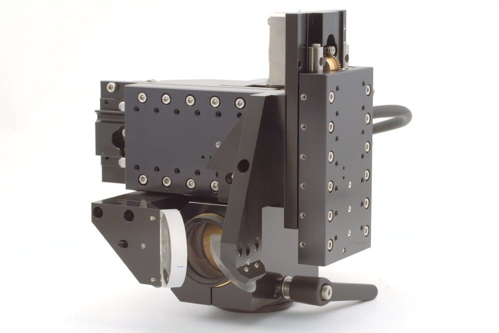
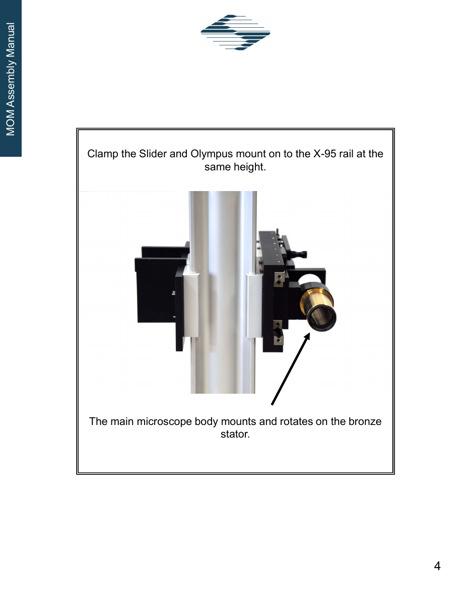
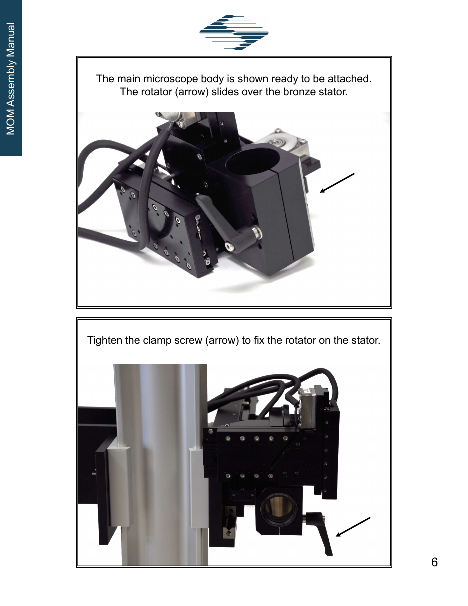

# Hardware — Sutter rig

Components of the **Sutter** 2P rig for in vivo 2PCI (2 Photon Calcium Imaging).

For the second rig, see [Hardware — Scientifica rig](hardware_scientifica.md).

## Computer
- [Dell Precision Tower 5810](https://www.dell.com/support/manuals/en-us/precision-t5810-workstation/precision_t5810_om_pub/technical-specifications?guid=guid-cb1a5aa6-1e70-44b9-b690-59507a3a9f31&lang=en-us)
    - Intel Xeon CPU E5-1630 @ 3.70 GHz
    - 32.0 GB RAM
    - NVIDIA NVS 310 Graphics

## Microscope
- [Sutter MOM (Moveable Objective Microscope)](https://www.sutter.com/microscopes/mom)
- Objective moves rather than the stage (stage moves on Scientifica rig)
- dichroic splitter (Di02-R561, Semrock)
- green emission filter (FF03-525/50, Semrock)
- objective: 40 0.8 NA objective (Olympus)
- [MOM Assembly Manual, June 2021](mom/MOM_Assembly_Manual_2021.pdf) (compressed copy, 67 pages)
  &mdash; head rotation on pp. 4–6, detector paths in Appendices A (short-path) and B
  (wide-path / Janelia), objective rings on p. 12
- The scan head can be **rotated about the tube-lens axis** to image a non-horizontal surface
  such as auditory cortex with the mouse upright. Manual, never used on this rig so far. See
  [Head rotation](#head-rotation).

### Head rotation

Confirmed with Rick Ayer (Sutter) on 2026-09-04. The MOM's rotation is a standard feature but
was not documented on this rig until then.

**Mechanism.** In the assembly manual's terms, the main microscope body carries a split-clamp
**rotator** that slides over a fixed **bronze stator**: the brass tube on the X-95 rail slider
that holds the tube lens. The whole scan head, including the dichroic slider and detector path,
rotates about that tube. A **clamp-screw lever** on the underside of the head locks the rotator
to the stator. There is no motor and no readout.

*Head alone, objective removed. The lever at the bottom right tightens the rotator's clamp
screw; the large bore at the centre is where the tube-lens tube passes through.*

**Range.** Clockwise: to fully upside down (180°). Counter-clockwise: about 15–20°.

**Procedure** (Rick Ayer's instructions):

1. Remove the objective, the first time at least.
2. **Support the head with your other hand before loosening the lever.** Do not loosen it
   unsupported.
3. Loosen the lever, rotate the head about the tube-lens tube, retighten.
4. The lever is spring-loaded: if it hits something before it is tight or loose, pull it out at
   its centre, re-seat it on the bolt at a new angle, and continue.
5. To read the angle, put a phone level app on the flat surface of the sideways (Y) axis.
6. Depending on the angle, the axis drive may need **external springs** to keep the internal
   spring tension high enough; without them the cable that pulls the axis can go slack. Ask
   Sutter for the spring kit once the angle is chosen.
7. Re-run the pollen-grain and fluorescent-slide checks at the new angle
   ([2P Laser Alignment](alignment.md)). Alignment upstream of the scan head is unchanged.

**Notes.**

- The pivot axis does not pass through the focal point, so rotating swings the focus through
  an arc. Set the angle once and re-target with the objective XYZ rather than adjusting the
  angle per session.
- ScanImage's `objectiveResolution` (angle-to-micron factor at the objective) is unaffected;
  stage-coordinate bookkeeping for revisiting fields of view is not.
- Sutter's video of the rotation, without procedural detail:
  [mom_rotation.mov](https://www.sutter.com/hubfs/WEB%20-%20Videos/mom_rotation.mov).

## DAQs
1. [NI USB-6229](https://www.ni.com/en-us/support/model.usb-6229.html) (ID: `Dev2`)
    - Ephus acquire / sound stimulation
2. [NI PCI-6110](https://www.ni.com/en-us/support/model.pci-6110.html) ([BNC-2090A breakout](https://www.ni.com/en-us/support/model.bnc-2090a.html?srsltid=AfmBOopdQvoEFCozmqVA2Lt85ZS6px0Op_LTcsLxxTvu_3GcCVlb8_pU)) (ID: `Dev1`)
    - ScanImage 2P:
        - Galvo Mirrors (Channels: `AO0`,`AO1`)​
        - PMT (Channels: `AI8`, `AI9`)
        - Shutter (Channels: `USER 1`)
        - Trigger output to trigger Ephus sound delivery (Channels: `USER 2`)
            - Path: `PFI13` (Digital I/O PFI terminal block) &rArr; `USER 2` &rArr; BNC cable &rArr; NI USB 6229 &rArr; PFI0/P1.0​ &rArr; PFI10 (terminal block)

## Widefield epifluorescence camera
- QImaging Retiga 2000R (1600 &times; 1200), FireWire (IEEE 1394)
- Image data connects **directly to the computer** via FireWire
- Camera trigger input driven by a QCam board, which is driven by the NI USB-6229 (`Dev2`, `AO3`)
- Used for widefield Ca2+ imaging to map cortical subfields and target A1 for 2P imaging
- See: [Widefield Epifluorescence](widefield.md)

## PMT
- Controller: [Sutter PS-2LV](https://www.sutter.com/MICROSCOPES/pmt.html)
- [Hamamatsu H10770PA-40](https://www.hamamatsu.com/jp/en/product/optical-sensors/pmt/pmt-module/current-output-type/H10770PA-40.html)

### Herringbone artifact

Diagonal stripes across the image are **normal for this PMT** and are not a fault, a
misalignment, or a laser problem.

**Cause.** The H10770PA-40 is a photosensor *module* — the high-voltage supply is built into the
detector head, and gain is set by a control voltage fed into it, which is what the
[PS-2LV](https://www.sutter.com/MICROSCOPES/pmt.html) provides. That built-in switching supply
puts **ripple** on the PMT output, reported in the **200–300 kHz** range for Hamamatsu GaAsP
PMTs and present even with no light reaching the detector. Because the ripple frequency is not an
exact multiple of the line rate, its phase advances slightly on each successive line, so it
renders as **diagonal stripes** rather than stationary vertical bands.

**Why gain changes it.** The gain control voltage is the input to that same supply, so changing
gain shifts the supply's operating point and with it the ripple frequency. That in turn changes
how the ripple beats against the fixed line period, so the artifact strengthens and weakens
**periodically as gain is stepped**. It is *not* a case of lower gain being better — step through
gain values and settle on one where the pattern is weakest.

**The cause is electrical, not optical.** It is unrelated to the photocathode geometry
(end-on / head-on vs side-on), which affects spatial uniformity and quantum efficiency rather
than producing a gain-dependent temporal pattern. Nothing about the beam path or alignment will
change it.

Specific to the Sutter rig — the Scientifica rig uses a different PMT and controller
([2PIMS-PMT-20](hardware_scientifica.md#pmt)), so an artifact there has another cause.

Reference: [Ripple noise on PMTs in 2-photon imaging](https://labrigger.com/blog/2016/05/11/ripple-noise-on-pmts-in-2-photon-imaging/) (Labrigger).

## Shutter
- Controller: [ThorLabs SC10 Shutter Controller](https://www.thorlabs.com/thorproduct.cfm?partnumber=SC10)

## Galvo / Scan controller
- [Sutter MDR MOM Scan Drive Controller](https://www.sutter.com/microscopes/mom)
- Galvo / Galvo mirrors for laser scanning

## Laser
- MaiTai HP, Newport
- No front-panel controls for wavelength, shutter, or laser on/off &mdash; operated from the computer via the MaiTai Customer GUI over USB (virtual COM port)
- See: [Software &rarr; MaiTai laser control](software.md#maitai-laser-control)

## Speaker and Speaker controller
- freefield speaker (ES1, Tucker Davis)
- ED1 speaker driver (Tucker Davis)

## Micromanipulator
- [Sutter ROE-200](https://www.sutter.com/MICROMANIPULATION/mpc365_frame.html)

## Power Intensity Controller
- [ThorLabs Kinesis Motor Controller KDC101](https://www.thorlabs.com/thorproduct.cfm?partnumber=KDC101) (K-Cube brushed DC servo motor controller)
- Rotates [PRM1Z8](https://www.thorlabs.com/thorproduct.cfm?partnumber=PRM1Z8) motorized precision rotation mount to adjust laser intensity entering Sutter enclosure
- Driven manually via the jog wheel on the KDC101, or digitally via Thorlabs Kinesis software
- Connection: PRM1Z8 &rArr; KDC101 (motor cable) &rArr; USB &rArr; acquisition computer
- See: [2P Laser Power control](laser_power_control.md)

## Temperature control
- FHC DC Temperature controller with heat pad and rectal thermister 
