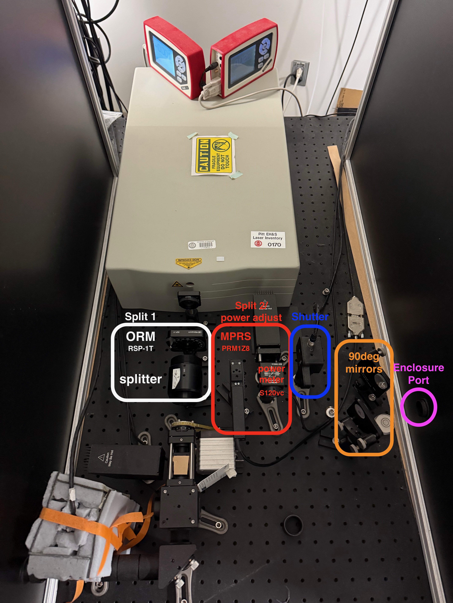

# Sutter 2P Rig Documentation

This documentation covers the setup, configuration, and operation of the Sutter 2P microscopy system for in vivo 2-photon calcium imaging (2PCI).

## Documentation Sections

### Reference
- [About](about.md) - Brief overview
- [Hardware](hardware.md) - Understand system components and wiring
- [Software](software.md) - Software installation and setup
- [Drivers](drivers.md) - Required drivers and installation
- [Pupillometry](pupillometry.md) - Details for capturing pupillometry

### Alignment and calibration
- [2P Laser Alignment](alignment.md) - Laser alignment procedures with safety protocols
- [Speaker Calibration](cal_speaker.md) - Procedures for calibrating the free-field speaker
- [Laser Power Calibration](cal_laser_power.md) - Laser power measurement

### Setup and installation
- [Computer Setup](computer_setup.md) - Install drivers and software to configure rig after reinstalling Windows
- [Configuration](configuration.md) - Ephus (widefield + sound stimuli) and ScanImage (2P) settings and detailed parameter explanations

### Daily Operation
- [Operation](operation.md) - Reference for acquisition loops etc.

### Data analysis and operation code
- [Code](code.md) - Custom scripts and analysis tools

## Support

**Primary Contact**: Rick Ayer (Sutter Instruments)
Email: rick@sutter.com

## External Resources

- [Sutter MOM Microscope](https://www.sutter.com/microscopes/mom)
- [Alignment Tutorial Video](https://www.youtube.com/watch?v=hwCFtQ3WHoo&t=452)
