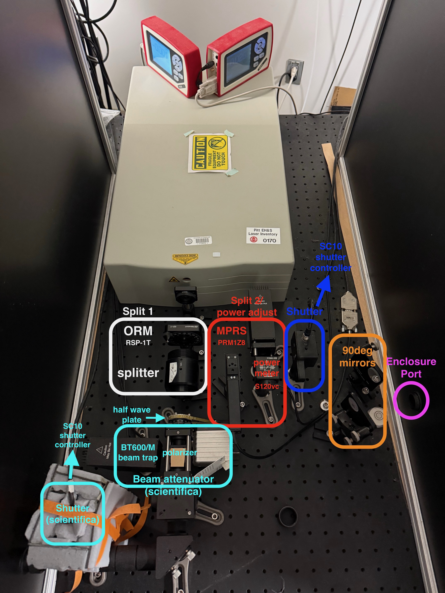

# 2P Rig Documentation

Setup, configuration, and operation of the lab's two in vivo 2-photon calcium imaging (2PCI)
rigs — the **Sutter** rig and the **Scientifica** rig.

The two rigs run the **same software stack** (Ephus 2.1.0, ScanImage 5.3.1/2017, the same custom
user functions) and share the **same MaiTai laser**, split between them. Most documentation is
therefore common to both; only the pages under each rig's own section are rig-specific.

| | Sutter | Scientifica |
|---|---|---|
| Microscope | Sutter MOM (objective moves) | Scientifica S-Scope-II (stage moves) |
| Computer | Dell Precision T5810 | Dell Precision T3600 |
| Widefield camera | Retiga 2000R (1600 × 1200) | Rolera-XR (696 × 520) |
| Laser power control | Thorlabs PRM1Z8 + KDC101, Kinesis | 1U rack `COM3`, LinLab 2 UMS |

## Common

Applies to both rigs.

- [Software](software.md) - Software stack and versions
- [Drivers](drivers.md) - Required drivers and installation
- [Configuration](configuration.md) - Ephus (widefield + sound stimuli) and ScanImage (2P) settings
- [Operation](operation.md) - Reference for acquisition loops etc.
- [Widefield Epifluorescence](widefield.md) - QCam widefield imaging for mapping cortical subfields to target A1
- [2P Laser Power control](laser_power_control.md) - Motorised waveplate attenuation on both rigs
- [2P Laser Alignment](alignment.md) - Alignment procedures with safety protocols
- [Speaker calibration](cal_speaker.md) - Calibrating the free-field speaker
- [2P Laser Power calibration](cal_laser_power.md) - Laser power measurement
- [Rig Setup](computer_setup.md) - Common install sequence after reinstalling Windows
- [Code](code.md) - Custom scripts and analysis tools

## Sutter rig

- [Hardware](hardware_sutter.md) - Components and DAQ channel assignments
- [Rig-specific drivers](setup_sutter.md) - Drivers unique to this rig
- [Pupillometry](pupillometry.md) - Details for capturing pupillometry

## Scientifica rig

- [Hardware](hardware_scientifica.md) - Components, 1U rack COM port map
- [DAQ wiring](wiring_scientifica.md) - Terminal-by-terminal wiring, signal chains, diagram
- [Rig-specific drivers](setup_scientifica.md) - Drivers unique to this rig

## Appendices

- [Galvo scan settings](appendix_galvo_scan_settings.md) - Why the rigs reach 5 Hz at different zoom factors, and fixing the comb artifact

## Support

**Primary Contact (Sutter)**: Rick Ayer (Sutter Instruments)
Email: rick@sutter.com

## External Resources

- [Sutter MOM Microscope](https://www.sutter.com/microscopes/mom)
- [Alignment Tutorial Video](https://www.youtube.com/watch?v=hwCFtQ3WHoo&t=452)
