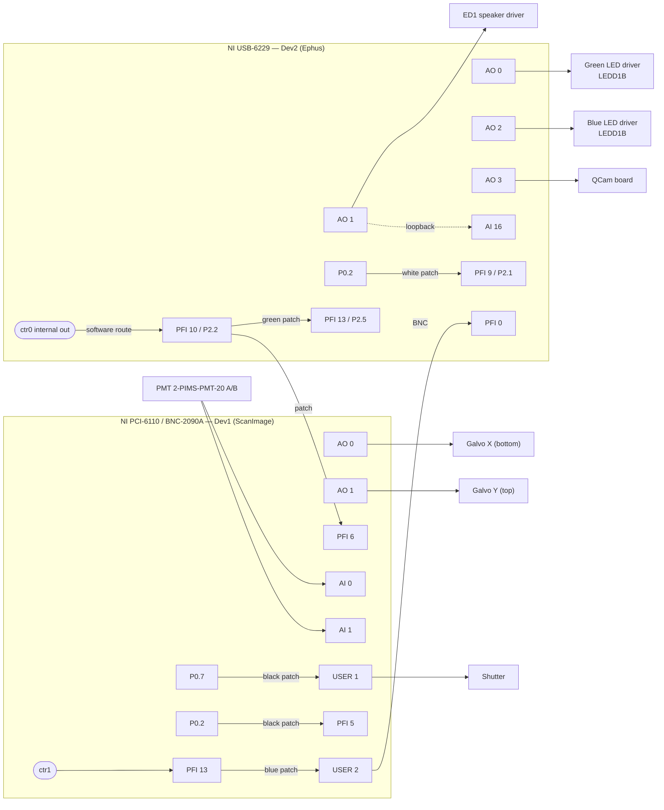

# Scientifica 2P rig — DAQ wiring reference

Physical wiring of the Scientifica 2-photon rig as of **2026-07-28**, following the Windows 10
upgrade. Device IDs are as enumerated by NI-DAQmx on the Windows 10 install.

| Device | Model | DAQmx ID | Used by |
|---|---|---|---|
| 1 | NI USB-6229 | `Dev2` | Ephus — sound stimulation, LED drivers, QCam trigger, analog monitoring |
| 2 | NI PCI-6110 (via BNC-2090A breakout) | `Dev1` | ScanImage — galvos, PMTs, shutter, 2P trigger out |

Two wire types are distinguished throughout:

- **BNC** — coaxial connections on the BNC breakout / device front panel.
- **Patch** — jumper wires between screw terminals on the digital & timing I/O block.

---

## 1. NI USB-6229 — `Dev2` (Ephus)

### 1.1 Analog output

| Terminal | Destination | Notes |
|---|---|---|
| AO 0 | Green LED driver (Thorlabs LEDD1B) | |
| AO 1 | ED1 speaker driver (Tucker-Davis) | **also looped back to AI 16** |
| AO 2 | Blue LED driver (Thorlabs LEDD1B) | |
| AO 3 | QCam board | Camera trigger |

### 1.2 Analog input

| Terminal | Source | Notes |
|---|---|---|
| AI 16 | Loopback from AO 1 | Sound output monitor |
| AI 17 | *(not connected)* | |

### 1.3 Digital & timing I/O

| Terminal | Connection | Wire | Direction |
|---|---|---|---|
| PFI 0 | ← `USER 2` on BNC-2090A | BNC | **in** — 2P trigger from ScanImage |
| PFI 9 / P2.1 | ← P0.2 | patch, white | **in** — Ephus internal trigger |
| PFI 10 / P2.2 | → PFI 13 / P2.5 | patch, green | **out** — sample clock fan-out |
| PFI 10 / P2.2 | → `PFI 6` on BNC-2090A | patch | **out** — sample clock to Dev1 |

> **Note on PFI 10.** It is a *driven output*, not an input. Ephus routes the ctr0 internal
> output onto PFI 10 in software (`ephus.m:384-389`, `nimex_connectTerms`), so both wires
> leaving PFI 10 are fan-outs of the sample clock. See §4.2.

---

## 2. NI PCI-6110 / BNC-2090A — `Dev1` (ScanImage)

### 2.1 Analog input

| Terminal | Source |
|---|---|
| AI 0 | 2-PIMS-PMT-20 (PMT) — A or B, right side of scope |
| AI 1 | 2-PIMS-PMT-20 (PMT) — the other of A / B |

### 2.2 Analog output

| Terminal | Destination |
|---|---|
| AO 0 | Scientifica galvo **X** (bottom) |
| AO 1 | Scientifica galvo **Y** (top) |

### 2.3 USER lines and digital I/O

| Terminal | Connection | Wire | Direction |
|---|---|---|---|
| `USER 1` | Shutter trigger TTL | BNC | **out** |
| `USER 1` | ← P0.7 | patch, black | internal route to the USER 1 BNC |
| `USER 2` | ← PFI 13 | patch, blue | internal route to the USER 2 BNC |
| `USER 2` | → PFI 0 on USB-6229 | BNC | **out** — 2P trigger to Ephus |
| PFI 5 | ← P0.2 | patch, black | **in** — ScanImage internal trigger |
| `PFI 6` | ← PFI 10 on USB-6229 | patch | **in** — Ephus sample clock |
| DGND | Scientifica PMT controller (2PIMS-8000) ground | patch | Common ground |

---

## 3. Diagram



---

## 4. Signal chains

### 4.1 2P-synchronised sound delivery — ScanImage triggers Ephus

```
ScanImage user function (acqModeArmed)
  → Dev1 ctr1 pulse, delay + width configurable
  → Dev1 PFI 13        (ctr1 default output terminal)
  → blue patch wire
  → Dev1 USER 2
  → BNC cable
  → Dev2 PFI 0
  → Ephus stimulator / acquirer external trigger  →  sound pulse on AO 1
```

Ephus must have `externalTriggerSource = PFI0` for this path
(`custom_user_fcns/setexternalTriggerSourcetoPFI0.m`).

This topology is identical to the Sutter rig (see [Configuration](configuration.md)), and
matches the old Win7
Scientifica ScanImage user function `scanimage/SCANIMAGE/Samples/charlie_stimPulse.m`:

```matlab
channel = 1;    % output the command on Ctr1 (PFI13)
```

### 4.2 Ephus sample clock

```
Dev2 ctr0 internal output
  → (routed in software by Ephus)
  → Dev2 PFI 10
  ├─ green patch wire → Dev2 PFI 13   (fan-out / monitoring tap)
  └─ patch wire       → Dev1 PFI 6    (shared timebase with ScanImage)
```

Configured in the Ephus init file as `sampleClockOrigin = '/dev2/ctr0'`,
`sampleClockDestination = 'PFI10'`.

> ⚠ **Do not change `sampleClockOrigin` to `/dev2/ctr1`.** The PFI 13 → PFI 10 wire makes it
> *look* as though the clock originates at ctr1, because PFI 13 is ctr1's default output
> terminal on M-series boards (ctr0 → PFI 12, ctr1 → PFI 13). It does not — Ephus explicitly
> connects `ctr0InternalOutput` to PFI 10 in software and never uses the default terminal.
> Selecting ctr1 would make DAQmx drive PFI 13 *and* PFI 10, which the green wire shorts
> together: two outputs on one line.

### 4.3 Ephus internal trigger

```
Dev2 P0.2  → white patch wire → Dev2 PFI 9  → Ephus stimulator / acquirer
```

Configured as `triggerOrigin = '/dev2/port0/line2'` with `PFI9` as the **first** entry in
`triggerDestinations` (the first entry must be the terminal the trigger-origin wire lands on).
Selected at runtime by `custom_user_fcns/setexternalTriggerSourcetoPFI9.m`.

### 4.4 ScanImage internal trigger

```
Dev1 P0.2  → black patch wire → Dev1 PFI 5
```

Matches the Win7 `standard.ini`: `triggerLineID = 2`, `triggerInputTerminal = 'PFI5'`.

### 4.5 Shutter

```
Dev1 P0.7 → black patch wire → Dev1 USER 1 → shutter trigger TTL
```

---

## 5. Terminal reference

Useful when reading the tables above.

| Fact | Value |
|---|---|
| M-series counter output terminals (default) | ctr0 → PFI 12, ctr1 → PFI 13, ctr2 → PFI 14, ctr3 → PFI 15 |
| PCI-6110 counters available | ctr0 and ctr1 **only** |
| Dev2 PFI 9 | = P2.1 |
| Dev2 PFI 10 | = P2.2 |
| Dev2 PFI 12 | = P2.4 |
| Dev2 PFI 13 | = P2.5 |

`USER 1` / `USER 2` on the BNC-2090A are uncommitted BNC connectors — they carry whatever
screw terminal is patched to them, which is why the shutter and 2P trigger both appear as
patch wires *and* BNC connections.

---

## 6. Serial / motion-control devices (LinLab 2)

Separate from the DAQ wiring above. The Scientifica control box presents its motorised
devices as **virtual COM ports** (FTDI USB-serial), and LinLab 2 shows one tab per device.

All three ports are **confirmed** (verified by moving each device and watching which port's
`POS` reply changed):

| COM | Device | LinLab 2 tab | `POS` reply | Used by ScanImage? |
|---|---|---|---|---|
| **COM3** | Beam attenuator | **UMS** (single axis, shown as Z) | one value | **No** — see §6.2 |
| **COM4** | **XYZ stage** | SliceScope — X, Y, Z | three values, X/Y/Z | **Yes** — `motors(1).comPort = 4` |
| **COM5** | Condenser | SliceScope — **C** | `0 0 <C>`; third value = LinLab's C | **No** — not configured |

> ⚠ **COM3 is the beam attenuator, and the inherited Sutter MDF specifies
> `motors(1).comPort = 3`** (its MPC200 was on COM3 — pure coincidence of numbering). Left
> unchanged, ScanImage would open the beam attenuator and try to drive it as the XYZ stage.

The SliceScope's X/Y/Z and its condenser axis are exposed as **two separate COM ports** from
the same control box — unplugging its USB cable removes both COM4 and COM5. Only COM4 is
configured in ScanImage; the condenser is operated from LinLab.

### 6.1 How to re-identify the ports

The mapping above was established by **motion**, which is the only reliable method: move one
device, poll each port, and see whose reply changes. Digit counts mislead — COM5 returns three
values (`0 0 <C>`) despite being a single-axis condenser.

Serial settings (from `+dabs/+scientifica/LinearStageController.m:38-39, 81`): **9600 baud,
CR terminator**, error response `E`. Positions are reported in **tenths of a micron**, so a
raw `-3815169` is LinLab's `-381516.9` µm.

```matlab
delete(instrfind); clear s          % release any stale port handles first
for p = {'COM3','COM4','COM5'}
    try
        s = serial(p{1},'BaudRate',9600,'Terminator','CR','Timeout',2);
        fopen(s); flushinput(s);
        fprintf(s,'POS'); pause(0.5);
        n = s.BytesAvailable;
        if n > 0
            raw = fread(s,n,'uint8');
            fprintf('%-6s "%s"\n', p{1}, strtrim(char(raw(:)')));
        else
            fprintf('%-6s no response\n', p{1});
        end
        fclose(s); delete(s);
    catch ME
        fprintf('%-6s ERROR: %s\n', p{1}, ME.message);
    end
end
delete(instrfind); clear s
```

Troubleshooting notes, all encountered in practice:

- **Close LinLab 2 first.** It opens the ports exclusively; MATLAB and ScanImage cannot open a
  port LinLab is holding.
- **Purge stale `serial` objects** (`delete(instrfind)`). A failed attempt leaves the port
  locked and the next read times out.
- **`flushinput` before each command.** A leftover byte desynchronises the next reply and
  produces nonsense — an early misread of COM4 returned `1.12`, which is not a position at all.
- **Reading raw bytes beats `fscanf`** while diagnosing, because it does not block waiting for
  a terminator that may not match.
- **Ports can renumber** after unplug/replug, especially into a different USB socket.

Note the port numbering has already drifted across reinstalls: the Win7
`scanimage/SCANIMAGE/standard.ini:167` specifies `COM8`, with a commented-out `COM5` on line
166 marked `%original setting`. **Pin the port** in Device Manager → Port Settings → Advanced
→ COM Port Number once identified.

Enumeration tip: PowerShell's `Win32_SerialPort` omits USB-serial adapters (it showed only
COM1 here). Use instead:

```powershell
Get-PnpDevice -Class Ports | Format-Table -AutoSize
```

### 6.2 Beam attenuator (LinLab **UMS** tab)

The laser beam attenuator is a Scientifica motorised device, appearing in LinLab 2 under the
**UMS** tab as a single axis (displayed as Z). **Confirmed on COM3.**

Mechanically it is a **motorised half-wave plate working against a fixed polarizer** — see
[2P Laser Power control](laser_power_control.md).

**Currently operated only through LinLab**, independently of ScanImage. The Win7 rig was the
same — `standard.ini` had all beam and photodiode fields empty.

This is the Scientifica counterpart to the Sutter rig's Thorlabs KDC101/PRM1Z8 waveplate
rotator, which is likewise controlled outside ScanImage.

#### Can it be controlled from ScanImage?

**Not through any native GUI setting.** ScanImage's beam system is *analog voltage
modulation* — `beamDaqs(1).chanIDs` is "Array of integers specifying **AO channel IDs**".
A stepper on a serial port cannot be a ScanImage "beam", and no MDF configuration will make
it one.

**There is, however, an unwired Scientifica class for exactly this device.**
`+dabs/+scientifica/MICU.m`:

```
%% M.I.C.U. - Motorized Intensity Control Unit
% Handle class to implement commands for Scientifica 3 Axis Linear Card
% Controller unit. To be integrated into ScanImage in a similar manner to
% devices such as the half wave plate.
```

Constructor `MICU(hSI, comPort)`; opens `serial(sprintf('COM%d',comPort),'BaudRate',9600,...)`.
Its own error text says *"ensure … the correct serial port is configured in the Machine Data
File"*, so MDF integration was the intent.

**The extension point is the MDF `components` field.** `+scanimage/SI.m:1300`
(`zprvLoadOptionalComponents`) accepts a class-name string **or a function handle**, calls
`feval(component, hSI)`, and attaches the result as `hSI.h<ClassName>`. Because `MICU` takes a
second argument, the handle form is required:

```matlab
components = {@(hSI)dabs.scientifica.MICU(hSI,3)};    % COM3 -> hSI.hMICU
```

Caveats, all verified against the 5.3.1 source:

| | |
|---|---|
| **Unwired / untested** | `MICU` is referenced in no other `.m` file in the distribution. (Hits in `+scanimage/FPGA/*.lvbitx` are coincidental bytes in binaries.) Its header says "*to be* integrated". |
| **Position, not power** | Methods are generic linear-card commands — `axisPosition [X Y Z]`, `moveXYAbsolute`, `moveZAbsolute`, joystick reverse flags. No angle→mW calibration. Compare `dabs.generic.halfWavePlate`, which adds `minPower` / `maxPower` / `angleAtMinPower`. |
| **No GUI** | `halfWavePlate` calls `obj.makeGui()`; `MICU` has no such method. Loading it yields a programmatic handle only. |
| **Port contention** | If ScanImage holds COM3, LinLab cannot open it, and vice versa. |

**Recommended approach if this is ever wanted:** follow the pattern already proven on this
rig — `PulseTrainPanelInit.m` + `pcPulseTrainTriggerPanel.m/.fig`, a standalone MATLAB GUI
launched alongside ScanImage. That is the same shape as `dabs.generic.halfWavePlate`, which is
likewise a standalone class building its own figure and referenced nowhere else in ScanImage.
Build a panel that opens COM3, exposes a calibrated power control, and enforces a ceiling;
`MICU` can serve as the serial command layer.

> ⚠ **Do not register the attenuator as `motors(2)`.** It is a Scientifica linear controller
> on a COM port, so it *would* connect — but ScanImage would treat it as a stage axis, expose
> it in the motor GUI, and could command it during stacks or "go home" operations. That is an
> unacceptable failure mode on a laser attenuator.
>
> Anything automating this should clamp to a maximum and fail safe (attenuate, not open) if
> the serial link drops.

### 6.3 Condenser (COM5)

**What it is for.** The condenser is the **transmitted-light illumination** optic, mounted
*below* the specimen — not part of the imaging path:

```
substage lamp/LED -> CONDENSER -> stage aperture -> specimen -> objective -> camera
```

It shapes illumination for **Köhler illumination**, which is what enables brightfield and
especially **DIC / IR-DIC** — the standard technique for visualising neurons and pipettes when
patch-clamping in living brain slices. Per the
[SliceScope Pro brochure](https://www.scientifica.uk.com/downloads/public/SliceScope-Pro.pdf):
*"Accepts both air and oil immersion condensers, including those required for DIC contrasting.
Motorised for optimal Koehler illumination."*

The COM5 controller is simply its **motorised focus** (height), so Köhler illumination can be
set without reaching under the stage.

**Why this rig does not use it.** Scientifica ships the SliceScope in two configurations, and
the condenser belongs to only one of them:

> *In vitro* — "includes the nosepiece arm, **condenser and substage optics**"
> *In vivo* — "the **condenser and substage optics are not required** and therefore can be
> simply **removed by the user**; this provides plenty of space to position the specimen and
> any peripheral equipment required."

This rig runs **in vivo** 2P and widefield. Neither modality uses transmitted light:

| Modality | Illumination | Path |
|---|---|---|
| 2P | MaiTai laser | down through the objective (epi) |
| Widefield | blue / green LEDs via LEDD1B drivers | from above (epi) |

The condenser therefore sits idle. It is safe to leave in place, or it can be removed per
Scientifica's instructions if it obstructs the preparation.

**Historical note.** The condenser, its substage optics, and the MultiClamp 700B link that was
removed from the Ephus startup file are all remnants of an earlier **in vitro patch-clamp**
configuration. The rig's current hotswitches (`transcranial`, `2P_*`, `Loop_Transcra`) are all
in vivo work. See `ephus_transition_plan.md` §2.5.

**Not configured in ScanImage — and was not on Win7 either.** In
`scanimage/SCANIMAGE/standard.ini` the secondary-controller block is entirely empty
(`controllerTypeZ=''`, `stageTypeZ=''`, `portZ=''`, lines 189–193); the only configured motor
is the `'scientifica'` / `'slice_scope'` XYZ stage. The sole occurrence of the string
`condenser` in the Win7 ScanImage tree is the driver's table of *supported* stage types
(`+dabs/+scientifica/LinearStageController.m`), not a configuration.

This is correct rather than an omission. ScanImage's motor configuration drives the **imaging**
axes — X/Y for position, Z for focus and stacks. The condenser positions transmitted-light
illumination below the specimen and has no role in 2P acquisition, so ScanImage has no reason
to hold its port. Operate it from LinLab.

---

## 7. Related documents

- [Hardware — Scientifica rig](hardware_scientifica.md) — component list for this rig.
- [Hardware — Sutter rig](hardware_sutter.md) — equivalent document for the Sutter rig, for
  comparison.
- [Configuration](configuration.md) — Ephus and ScanImage settings.
- `ephus_transition_plan.md` (rig notes, not part of this site) — evaluation of the Ephus init
  file against this wiring.
